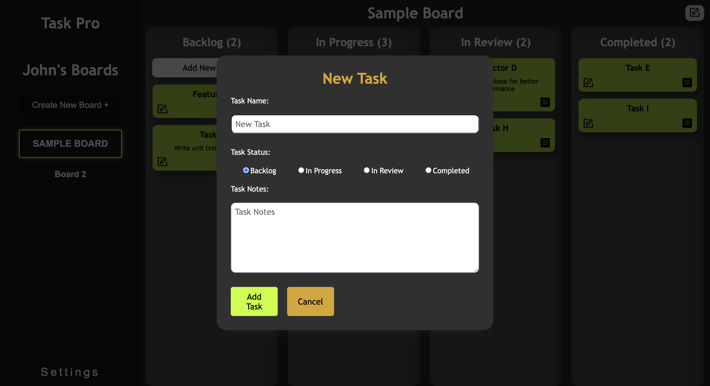

# Task Pro

Task Pro is an intuitive web application crafted to streamline task and project management. It empowers users of all proficiency levels to enhance their time management and organizational abilities with its user-friendly interface. Whether you opt for private usage or collaboration, Task Pro offers a comprehensive solution for creating, organizing, and sharing projects seamlessly.

## Project Frames


## Features

### User Sign-Up and Login
- Easily create a user profile to personalize user experience.
- Secure authentication ensures your private boards are only accessible to you.


### Board Management
- Create new board with ease.
- Organize your task for different stage for efficiently managing a project.





## Front End 

- Developed using **React** for a responsive and dynamic user interface.
- Utilizes **React Router** for smooth navigation between pages.
- Stylish and customizable design with **SCSS** for a modern look and organized styling.


## Back End

- Powered by **Node.js** and **Express** for robust server-side functionality.
- Data storage and retrieval are handled by **MongoDB**, ensuring data persistence and flexibility.


## Stretch Features

In the future, we plan to introduce the following features:

- Keep your project sets private for personal use or collaborate them with others.
- Share sets can be accessed together with multiple method of invites, keeping team on the same page.
- Enhance the Project-sharing system with comments for better communication.
- Drag and drop to improve user experiences.
- Light and Dark mode.
- OTP/Email 2 step authentication.


## Technologies Used


**Front End:**
- **React**
- **React Router**
- **React Portal**
- **SCSS**

**Back End:**
- **Node.js**
- **TypeScript**
- **Express**
- **MongoDB**
- **Vite**


## To Contribute or Use the Application

 **Step 1**. Clone repo to code editor

 **Step 2**. Run npm install to install all dependencies

 **Step 3**. Make sure node version is 18.17.1 or older, can use nvm to install the needed version.

 **Step 4**. Create env file and make sure to have ```PORT = 3000``` and ```MONGO_URI = (Mongodb connection URI)```

 **Step 5**. start the project with ```npm start``` or ```npm run dev``` (for dev mode)

#### Authors

- Nam Ha: [Github](https://github.com/username)

- John Costello: [Github](https://github.com/johnlcos)

